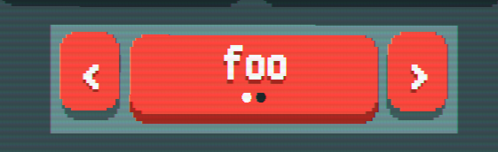

# create_option_cycle(args[^1])
Creates a selection box that can be cycled through to select a specific option, this element is similar to the one used to select the game's speed.

located in: Balatro
### Example usage
```lua
SMODS.current_mod.config_tab = function()
    return {n = G.UIT.ROOT, config = {
        ...
    }, nodes = {
        create_option_cycle({
            options = {
                "foo",
                "bar"
            },
            opt_callback = "my_option_cycle"
        })
    }}
end


function G.FUNCS.my_option_cycle(e)
    ...
end
```

[^1]: args table
    | key  | type | description |
    | ------------- | ------------- | ------------- |
    | label | string | The text to display in the main cycle box |
    | id | string | (optional) The identifier used to search for the specific node. |
    | colour  | table  | The colour of the cycle box and buttons, defaults to `G.C.RED` (#FE5F55). |
    | options | table | The options to display in the options cycle, defaults to `{ 'Option 1', 'Option 2' }`. |
    | current_option | int | The index of the currently selected option, defaults to `1`.  |
    | no_pips | bool | Determines if the pips are displayed on the option cycle, provided there is enough space. If left out, it will attempt to put pips in the option cycle. |
    | opt_callback | string | The name of the function in `G.FUNCS` to be called, it will pass along a table of callback arguments[^2]. If left empty, no function will be called. |
    | scale | number | The scale of the option cycle, defaults to `1`. |
    | ref_table | table | A reference to a table to retrieve data from at a undetermined point in time. |
    | ref_value | string | The name of the key in the `ref_table`. |
    | w | number | Determines the minimum width of of the main cycle element (before scaling), defaults to `2.5`. |
    | h | number | Determines the minimum height of of the main cycle element (before scaling), defaults to `0.8`. |
    | text_scale | number | Determines how big the text will be scaled, defaults to `0.5`. |
    | focus_args | table | A table containing hints on how passing around focus should be handled. |
    | info | table | The lines of text to display under the option cycle. |
    | mid| (node) table | Overrides the middle section of the options cycle and replaces it with a custom UI node. If left empty, the default cycle box will be used instead. |
    | cycle_shoulders | bool | ?  (suggests toggling gamepad behaviour, however precise effect has not been figured out). |
    | on_demand_tooltip | table | Adds a tooltip when the main cycle boc is hovered over. See `tooltip` for structure information. |

[^2]: callback argument table
    | key  | type | description |
    | ------------- | ------------- | ------------- |
    | from_val | string | The value of the previously selected option. |
    | to_val | string | The value of the selected option. |
    | from_key | int | The index of the previously selected option. |
    | to_key | int | The index of the selected option. |
    | cycle_config | table | The reference table containing the node information of the option cycle that invoked the callback. |